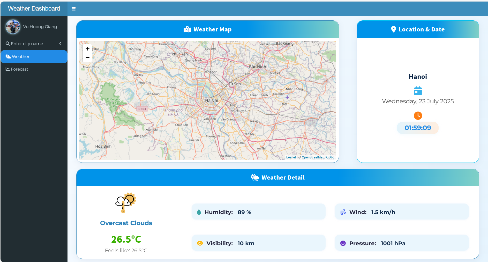

# Weather Dashboard 🌦️



A modern interactive weather dashboard built with R Shiny, leveraging the OpenWeatherMap API.
**Try the live demo:** [giangvu.shinyapps.io/DSR301m\_assignment/](https://giangvu.shinyapps.io/DSR301m_assignment/)


## Features

* 🔍 **Search weather by city name**
* 🗺️ **Interactive map**: Click on any location to get instant weather information
* 📊 **5-day forecast**: View weather trends by parameter (temperature, humidity, wind, pressure, etc.)
* 🌡️ **Temperature vs Humidity**: Visualize their relationship in Hanoi (or selected city)
* 🖌️ **Modern UI**: Custom CSS, responsive design, animated transitions, and Font Awesome icons

## Table of Contents

* [Demo](#demo)
* [Features](#features)
* [Installation](#installation)
* [Configuration](#configuration)
* [Usage](#usage)
* [Project Structure](#project-structure)
* [API Reference](#api-reference)
* [Screenshots](#screenshots)
* [License](#license)

---

## Demo

You can try the deployed app here:
➡️ [giangvu.shinyapps.io/DSR301m\_assignment/](https://giangvu.shinyapps.io/DSR301m_assignment/)

## Installation

1. **Clone the repository**

   ```bash
   git clone https://github.com/giangvu04/Weather-Dashboard.git
   cd Weather-Dashboard
   ```

2. **Install R packages**
   The following R packages are required:

   * shiny
   * shinydashboard
   * ggplot2
   * leaflet
   * httr
   * urltools
   * lubridate
   * plotly
   * dplyr

   You can install them via R console:

   ```r
   install.packages(c(
     "shiny", "shinydashboard", "ggplot2", "leaflet", "httr",
     "urltools", "lubridate", "plotly", "dplyr"
   ))
   ```

## Configuration

This app uses the **OpenWeatherMap API**.

1. Register a free account at [openweathermap.org](https://openweathermap.org/) and obtain your **API key**.
2. In `app.R`, replace the value of `api_key` variable with your own key:

   ```r
   api_key <- "YOUR_OPENWEATHERMAP_API_KEY"
   ```

## Usage

* Run the app locally:

  ```r
  shiny::runApp()
  ```
* The dashboard opens in your browser.
* Enter a city name and click "Get Weather" to fetch current weather.
* Click on any location on the map to get weather for that spot.
* Switch tabs to explore weather details and forecasts.

## Project Structure

```
weather-dashboard-shiny/
│
├── app.R                # Main application code (UI + server)
├── www/
│   └── GiangNek.jpg     # Avatar image (optional)
├── README.md
└── screenshot.png       # Example screenshot (add yours)
```

## API Reference

* [OpenWeatherMap API Docs](https://openweathermap.org/current)

  * `/data/2.5/weather`: current weather by city or geo-coordinates
  * `/data/2.5/forecast`: 5-day/3-hour forecast data


## License

This project is for educational purposes.
Feel free to fork, use, or modify for your learning or personal use.

---

*Developed by Vũ Hương Giang, 2024 – as a final assignment for DSR301M.*
